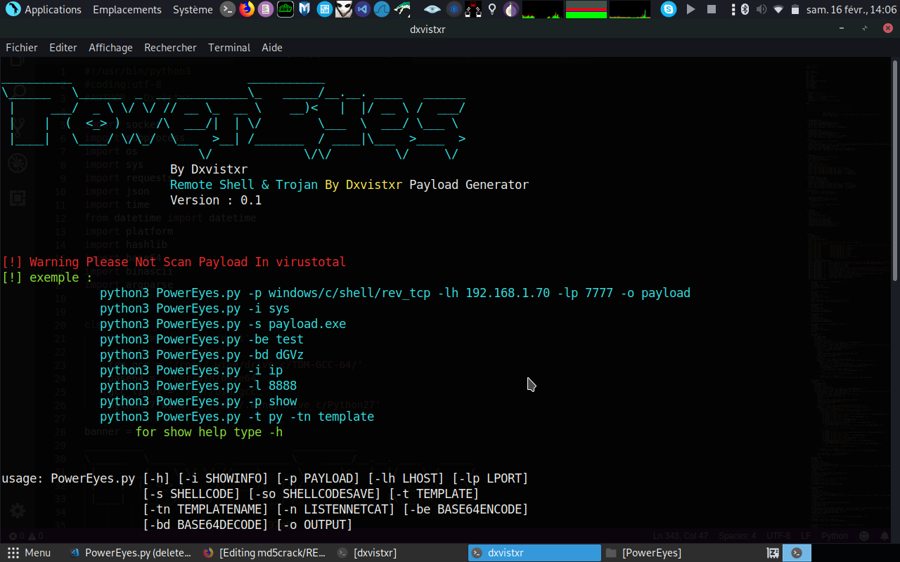

# PowerEyes
## PowerEyes V0.1 16/02/2019 - Payload Generator
## Payload C & Python & PHP & Bash

## Setup :
 ## Debian & Ubuntu:
 ## apt update && apt upgrade -y && apt install git python3 coreutils -y
 ## sudo git clone https://github.com/VnomDavistar/PowerEyes/
 ## cd PowerEyes && sudo chmod +x install.py && python3 install.py
 ## python3 PowerEyes.py -h
